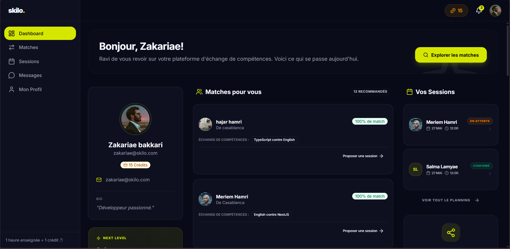

# Skilo — Échangez vos compétences

**Skilo** est une plateforme d'apprentissage collaboratif innovante basée sur l'échange de temps et de savoirs. Le concept est simple : enseignez ce que vous maîtrisez pour gagner des crédits, et utilisez ces crédits pour apprendre de nouvelles compétences auprès d'autres passionnés.

---


## 📸 Aperçu

---

## L'Équipe
Ce projet a été conçu et développé avec passion par :
- **Zakariae Bakkari** ([@zakariaebakkari](https://github.com/zakariaebakkari))
- **Meriem Hamri** ([@Meriem-9-9](https://github.com/Meriem-9-9))

---

## Liens de Déploiement

- **Frontend** : [skilo-frontend-five.vercel.app](https://skilo-frontend-five.vercel.app/)
- **Backend (API)** : [skilo-backend-sigma.vercel.app](https://skilo-backend-sigma.vercel.app/)

---

## Fonctionnalités Clés

- **Matching Intelligent** : Un algorithme qui analyse vos compétences offertes et recherchées pour vous proposer des "Matchs Parfaits" (échange réciproque gratuit) ou des "Matchs Partiels" (échange contre crédits).
- **Économie de Crédits Temps** : Système basé sur l'équité où **1 session = 1 crédit**. Un système de balance équilibrée assure une circulation fluide des connaissances.
- **Gestion des Sessions** : Interface complète pour proposer, accepter et suivre vos sessions d'échange. Intégration automatique de liens de réunion vidéo.
- **Messagerie Intégrée** : Chat en temps réel avec WebSockets pour discuter et organiser vos échanges avec vos partenaires.
- **Système de Parrainage** : Invitez vos amis et recevez des crédits bonus pour booster votre apprentissage dès leur inscription.
- **Design Premium** : Une interface moderne, sombre et épurée (Glassmorphism), optimisée pour une expérience utilisateur fluide sur tous les supports.

---

## Stack Technique

### Architecture Monorepo ([Turborepo](https://turbo.build/))
- **Frontend** : [Next.js 16](https://nextjs.org/) (App Router), TypeScript, Tailwind CSS, Lucide React, Framer Motion.
- **Backend** : [NestJS](https://nestjs.com/), TypeScript, Prisma ORM, WebSockets (Socket.io).
- **Base de données** : [PostgreSQL](https://www.postgresql.org/) hébergé sur [Neon.tech](https://neon.tech/).
- **Authentification** : Système JWT sécurisé avec gestion des sessions.
- **Déploiement** : [Vercel](https://vercel.com/) pour le Frontend et le Backend.

---

## Démarrage Rapide

### 1. Prérequis
- [Node.js](https://nodejs.org/) (v18+)
- [pnpm](https://pnpm.io/)

### 2. Installation
Installez les dépendances depuis la racine du projet :
```sh
pnpm install
```

### 3. Configuration
Configurez vos variables d'environnement dans les dossiers respectifs :
- `apps/backend/.env` (DATABASE_URL, JWT_SECRET)
- `apps/frontend/.env.local` (NEXT_PUBLIC_API_URL, NEXT_PUBLIC_WS_URL)

### 4. Lancement
Démarrez les serveurs frontend et backend en simultané :
```sh
pnpm dev
```

L'application sera accessible sur `http://localhost:2004` (Frontend) et l'API sur `http://localhost:2006` (Backend).

---

## Licence
Projet développé par Zakariae Bakkari et Meriem Hamri. Tous droits réservés.
